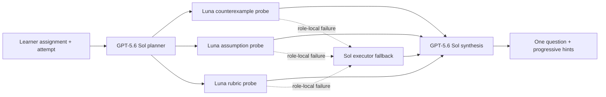

# ReasonPatch v2

> AI office hours for the reasoning step that is actually stuck.

ReasonPatch helps a learner bring a real assignment, its constraints, and a current attempt in one of four domains:

- formal logic;
- algebra;
- Python;
- causal reasoning.

It preserves what already works, locates the first consequential break, and asks one focused question. Hints appear progressively. The learner—not the model—edits the draft, after which ReasonPatch creates an evidence-bound revision receipt. Curated guided examples end with a fresh-context check that receives none of the prior coaching context.

This v2 branch is local-only. It has not been pushed or deployed, and it does not change the submitted public build.

## Product flow

1. **Attempt** — Choose a domain and bring the problem, constraints, and current work.
2. **Question** — Review preserved strengths, the exact hinge, one Socratic question, and optional graduated hints.
3. **Revision** — Edit an exact copy of the learner's own attempt and check it against visible criteria.
4. **Apply** — For guided scenarios only, answer a fresh case through an isolated endpoint that receives only the scenario ID and new response.

Guided examples are immutable, credential-free fixtures with narrow deterministic checks. Their provenance explicitly says `simulated: true` and `modelCalls: 0`; they do not pretend to be live model runs.

Custom live coaching uses this bounded orchestration:



The three executor jobs run concurrently. A quota, timeout, upstream, or invalid-output failure falls back to Sol for that role only. Learner text stays in structured user input and is never interpolated into model instructions.

## Run locally

Requirements: Node.js 20.9+ and npm.

```bash
npm install
npm run dev
```

Open [http://localhost:3000](http://localhost:3000). Guided mode works without a credential.

Live mode is disabled by default. To enable it only in a protected local environment, create `.env.local`:

```dotenv
OPENAI_API_KEY=your_key
REASONPATCH_LIVE_MODE=true
NEXT_PUBLIC_REASONPATCH_LIVE_MODE=true
```

The server flag is authoritative; the public flag only reveals the consent-gated client path. Do not expose paid live mode publicly without a signed session, a durable atomic spend gate, and distributed rate/concurrency limits.

## Security and privacy boundaries

- No browser API-key, provider, model, or endpoint controls.
- OpenAI calls are server-only, use Structured Outputs, set `store: false`, and have bounded output and time limits.
- Same-origin JSON requests only, with actual UTF-8 byte limits and an explicit mode header.
- Forwarding headers are ignored by the default limiter; a deployment may supply a trusted identity adapter explicitly.
- Strict request/output schemas reject unknown properties and bound every learner/model field.
- Evidence quotations must occur in learner-submitted text; Python matching remains case-sensitive.
- Submitted Python is displayed and inspected as text. It is never executed.
- Learner and model text is rendered through React text nodes; no raw HTML or unsanitized Markdown.
- No automatic local storage, database persistence, analytics payload, or learner text in URLs.
- Guided transfer rejects original attempts, diagnoses, revisions, and hints at the request boundary.
- Results describe observed text evidence, not correctness, grades, authorship, mastery, or proof of learning.

## Verification

```bash
npm run lint
npm run typecheck
npm run test:coverage
npm run build
npm run test:e2e
npm audit
```

The v2 suite includes schema, orchestration, fallback, grounding, immutable-state, deterministic scenario, API-boundary, component, accessibility, and browser-flow checks. Coverage is required to remain above 80% in every aggregate metric.

## Key implementation files

- [Office-hours workspace](src/components/office-hours-studio.tsx)
- [Sol/Luna orchestration](src/features/coach/office-hours-coach.ts)
- [Strict coaching contracts](src/features/coach/contracts.ts)
- [Immutable guided catalog](src/features/coach/scenarios.ts)
- [Guided deterministic checks](src/features/coach/scenario-evaluator.ts)
- [Evidence-bound review service](src/features/coach/review-service.ts)
- [Request boundary](src/app/api/request-boundary.ts)
- [Server-only OpenAI gateway](src/lib/ai/openai-gateway.ts)

## Honest limitations

- Deterministic guided checks are narrow scenario fixtures, not general proof, algebra, code, or causal-analysis validators.
- Live output is formative and fail-closed when structured output or evidence grounding cannot be verified.
- The in-process limiter is suitable for this local build, not a multi-instance school deployment.
- Fresh transfer is available only for curated scenarios and is immediate response evidence, not a validated measure of retention.
- A real educational deployment still requires institutional privacy review, authenticated authorization, durable budgets, distributed abuse controls, educator evaluation, and a learner-outcomes study.

## License

MIT — see [LICENSE](LICENSE).
