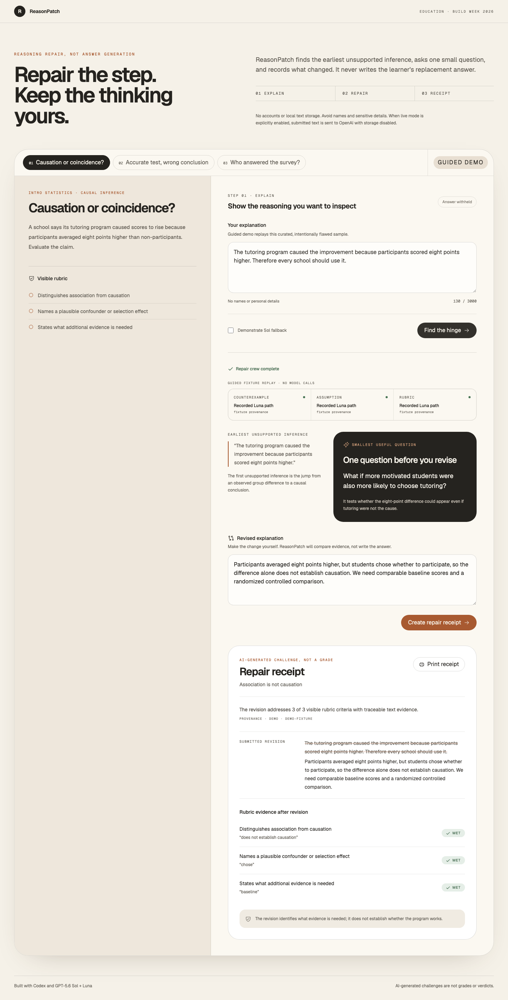
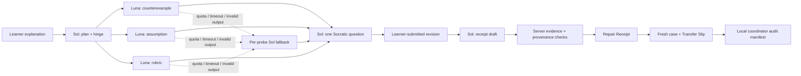

# ReasonPatch

> Repair the step. Keep the thinking yours.

**[Try the public guided demo](https://reasonpatch.vercel.app)** · **[View the source](https://github.com/FusionCube18712/reasonpatch)**

ReasonPatch is an Education-track reasoning repair studio for introductory statistics. It finds the earliest unsupported inference in a learner's explanation, asks one Socratic question, turns the submitted revision into an evidence-bound Repair Receipt, and then checks the same reasoning on a fresh case.

It is deliberately not a chatbot, answer generator, grade, or mastery detector.



## Why this matters

AI tutors can ask useful Socratic questions, but a helpful chat can still leave an instructor unable to inspect exactly what the learner repaired. ReasonPatch turns that gap into the product surface: it withholds the replacement answer and requires a submitted repair. The resulting receipt records observable changes against a visible rubric. A second, isomorphic case checks whether the same reasoning appears in a new context—without pretending that one transfer slip proves learning, authorship, or mastery.

The working prototype includes three focused introductory-statistics labs:

- correlation versus causation;
- base-rate neglect;
- sampling bias.

## The product tour

1. **Explain** — Start from an intentionally flawed explanation and a visible rubric.
2. **Repair** — GPT-5.6 Sol locates the reasoning hinge. Three role-separated GPT-5.6 Luna probes inspect counterexamples, hidden assumptions, and rubric evidence in parallel. Sol asks one smallest-useful Socratic question.
3. **Receipt** — The learner submits a revision. Sol compares before and after evidence, while ReasonPatch verifies that every quoted hinge and rubric excerpt actually occurs in the submitted text.
4. **Transfer** — The learner applies the repaired reasoning to an immediate fresh-context case isolated as a separate response step. A Transfer Slip records only supported evidence, and an optional local coordinator manifest preserves both submissions and their audit trail without inventing a learning score.

Guided mode is a deterministic, clearly labeled fixture replay so the public demo remains free and reliable. Live GPT mode is server-disabled by default and intended for a protected evaluator or local environment.

## Architecture



Key implementation choices:

- official OpenAI JavaScript SDK and Responses API;
- `gpt-5.6-sol` for planning, synthesis, receipts, and executor fallback;
- `gpt-5.6-luna` for three parallel, role-separated probes;
- strict Zod Structured Outputs with bounded fields and `store: false`;
- exact evidence-substring validation and executor-role verification;
- per-task output budgets, 12-second request timeout, and no SDK retries;
- truthful fallback and fixture provenance in the UI;
- server-only instructor intent, verified absent from production client chunks;
- a dedicated demo-only transfer boundary with fresh-context grounding and stale-case rejection;
- an immediate fresh-context check and local, explicitly unvalidated coordinator audit manifest.

See [the architecture notes](docs/ARCHITECTURE.md) for boundaries and failure modes.

## Run locally

Requirements: Node.js 20.9+ and npm.

```bash
npm install
npm run dev
```

Open [http://localhost:3000](http://localhost:3000). Guided mode works without credentials.

To expose protected/local live mode, copy `.env.example` to `.env.local` and set all three values:

```dotenv
OPENAI_API_KEY=your_key
REASONPATCH_LIVE_MODE=true
NEXT_PUBLIC_REASONPATCH_LIVE_MODE=true
```

`REASONPATCH_LIVE_MODE` is the authoritative server gate. The public flag only reveals the UI control. Do not enable public paid mode without a signed session gate, a distributed atomic rate limiter, and a spend/concurrency budget.

## Judge test path (about 90 seconds)

The deployed guided path needs no account, API key, or rebuild:

1. Open the [public demo](https://reasonpatch.vercel.app) and select **Find the hinge**.
2. In the revision box, enter:

   > Participants averaged eight points higher, but students chose whether to participate, so the difference alone does not establish causation. We need comparable baseline scores and a randomized controlled comparison.

3. Create the Repair Receipt, then select **Begin isolated fresh case**.
4. In the fresh-case box, enter:

   > The recovery difference does not establish causation because patients chose whether to join. Random assignment or a controlled comparison would be stronger.

5. Create the Transfer Slip and open the two separate educator artifacts.

The replay is explicitly labeled and makes no model calls. To test genuine Sol/Luna execution locally, enable protected live mode using the environment settings above; the same interface then accepts an original explanation and displays live model provenance.

## Verification

```bash
npm run check       # lint + types + coverage + production build
npm run test:e2e    # Chromium + Pixel 7 flows, visual QA, keyboard, axe
```

Current verified baseline:

- 125+ tests across unit, integration, and 79 repair/transfer calibration cases;
- 95%+ statements, 83%+ branches, 99%+ functions, and 97%+ lines;
- 16 Playwright checks across desktop/mobile projects;
- no serious WCAG A/AA violations in tested initial, receipt, and transfer states;
- zero production dependency audit vulnerabilities;
- no instructor-only strings in the generated client bundle.

The calibration suite is a deterministic functional check of repair and fresh-case evidence across complete, partial, stale-context, factually inconsistent, and prompt-injection-like responses. The transfer path uses a separate demo-only API and requires grounding in the fresh prompt before it records candidate evidence. It is not a learning-outcomes study. See [evaluation notes](docs/EVALUATION.md) and the [draft educator pilot protocol](docs/PILOT_PROTOCOL.md).

## Impact case, stated carefully

ReasonPatch is informed by established work on prompted self-explanation, attempt-before-instruction, and information-rich formative feedback. It also targets conceptual statistics errors documented across introductory courses. Those adjacent findings motivate the product; they do not validate it.

The product therefore refuses to call one good revision “learning.” Its demo creates a second observable artifact through an immediate fresh-context step isolated as a separate response. That demo step is not a delayed or blinded transfer measure.

The local export produces two deliberately separate artifacts: a blinded rater packet with anonymous response IDs, non-chronological order, and blank rubrics; and a coordinator audit manifest with the private stage map, provenance, and automated evidence. Both still contain submitted text, so a coordinator must de-identify them before approved sharing. A real comparison with answer-first help would pair this separation with an isolated delayed case delivered from a held-out server-side prompt pool. The proposed study, measures, citations, and caveats are documented in the [educator pilot protocol](docs/PILOT_PROTOCOL.md).

## Reproduce the narrated demo

On macOS with `ffmpeg` and `ffprobe` installed:

```bash
npx playwright install chromium
npm run demo:video
```

The recorder drives the deployed product, burns in captions, narrates the Sol/Luna and Codex implementation, verifies the final cut is under three minutes, and writes the upload-ready MP4 to `artifacts/demo-video/`. Generated media is intentionally excluded from Git.

## Safety and privacy boundary

- No accounts, database, file uploads, automatic browser persistence, or model tools. Raw-text educator files persist only when a user explicitly downloads them.
- Learner text is placed in user content, never interpolated into system instructions.
- Live requests use `store: false`; the app does not persist learner text.
- Cross-site, non-JSON, and over-16 KB API requests are rejected.
- Strict request/output schemas and generic error envelopes prevent data leakage.
- Client-forced Sol execution is forbidden in live mode.
- Rate limits include bounded identity state and a per-instance global breaker.
- Receipts describe text evidence only; banned mastery/authorship claims are schema-rejected.

Learners should still remove names and sensitive details. A real multi-instance school deployment would also need institutional privacy review, a signed anonymous session, distributed rate limiting, and a formal educator/user study.

## Codex collaboration

This project began as a blank repository during OpenAI Build Week 2026 and was built with Codex as the engineering environment.

Codex contributed to:

- product planning and Education-track differentiation;
- GPT-5.6 Sol/Luna orchestration and failure-mode design;
- test-first implementation through explicit RED and GREEN commits;
- official OpenAI API/model documentation verification;
- frontend design, responsive implementation, and browser QA;
- independent code, security, architecture, and judge-style reviews;
- accessibility, privacy, dependency, and production-bundle verification;
- demo narrative and submission packaging.

### Judge-visible build trail

The repository started empty during Build Week. These dated checkpoints expose the actual Codex collaboration loop instead of asking judges to infer it from the final code:

| Decision and verification gate | RED evidence | GREEN / hardening evidence |
|---|---|---|
| Define the earliest-hinge repair contract before implementation | [`8670c21`](https://github.com/FusionCube18712/reasonpatch/commit/8670c21) | [`01e4c35`](https://github.com/FusionCube18712/reasonpatch/commit/01e4c35) |
| Add the live GPT-5.6 gateway, Structured Outputs, and evidence-bound receipt | [`45909e4`](https://github.com/FusionCube18712/reasonpatch/commit/45909e4) | [`80724d1`](https://github.com/FusionCube18712/reasonpatch/commit/80724d1) |
| Refuse to treat one successful edit as transfer; add an isolated fresh case | [`91cc199`](https://github.com/FusionCube18712/reasonpatch/commit/91cc199) | [`c157d79`](https://github.com/FusionCube18712/reasonpatch/commit/c157d79) |
| Attack stale-copy, contradiction, negation, and relation-smuggling failures | [`cc5a9ad`](https://github.com/FusionCube18712/reasonpatch/commit/cc5a9ad) | [`9c82d97`](https://github.com/FusionCube18712/reasonpatch/commit/9c82d97), [`92d0549`](https://github.com/FusionCube18712/reasonpatch/commit/92d0549) |

The primary Codex build task has session ID `019f71f8-76e3-7462-b8a5-7d571dbe5466`; this task predates the first commit and contains the majority of the core implementation. The implementation itself is inspectable in the [Sol/Luna orchestrator](src/features/repair/orchestrator.ts), [Responses API gateway](src/lib/ai/openai-gateway.ts), [strict contracts](src/features/repair/contracts.ts), and [fresh-context evaluator](src/features/repair/transfer-evaluator.ts).

## Submission kit

- [Under-three-minute demo script](docs/DEMO_SCRIPT.md)
- [Devpost/submission copy and checklist](docs/SUBMISSION.md)
- [Architecture and threat boundaries](docs/ARCHITECTURE.md)
- [Evaluation protocol](docs/EVALUATION.md)
- [Educator pilot protocol and research rationale](docs/PILOT_PROTOCOL.md)
- [Fixed rapid educator feasibility-review instrument](docs/EDUCATOR_FEASIBILITY_REVIEW.md)

## Honest limitations

- Guided calibration is intentionally narrow and uses interpretable keyword evidence rules; it is not a general reasoning benchmark.
- Live quality depends on model output and is fail-closed when evidence cannot be verified.
- The included limiter is bounded and useful for a single demo instance, not a substitute for a distributed production limiter.
- The Transfer Slip is immediate text evidence in a fresh context, not a validated measure of retention or learning.
- The demo's small fresh-case prompt pool is shipped in the public client bundle, so those prompts are neither secret nor held out; a pilot would need access-controlled server delivery from a larger preregistered pool.
- Both local educator artifacts contain submitted text and must be de-identified before approved sharing; only the stripped, unscored rater packet is suitable for blinded review.
- No claim is made that ReasonPatch improves learning outcomes until an educator-reviewed comparison is run.

## License

MIT — see [LICENSE](LICENSE).
