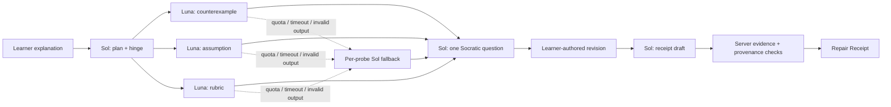

# ReasonPatch

> Repair the step. Keep the thinking yours.

**[Try the public guided demo](https://reasonpatch.vercel.app)** · **[View the source](https://github.com/FusionCube18712/reasonpatch)**

ReasonPatch is an Education-track reasoning repair studio for introductory statistics. It finds the earliest unsupported inference in a learner's explanation, asks one Socratic question, and turns the learner's own revision into an evidence-bound Repair Receipt.

It is deliberately not a chatbot, answer generator, grade, or mastery detector.


## Why this matters

Most AI learning tools optimize for producing a correct answer. That can erase the exact reasoning step an instructor needs to see. ReasonPatch withholds the replacement answer and makes the learner perform the repair. The resulting receipt records observable changes against a visible rubric without claiming that learning, authorship, or mastery has been proven.

The working prototype includes three focused introductory-statistics labs:

- correlation versus causation;
- base-rate neglect;
- sampling bias.

## The 45-second product tour

1. **Explain** — Start from an intentionally flawed explanation and a visible rubric.
2. **Repair** — GPT-5.6 Sol locates the reasoning hinge. Three role-separated GPT-5.6 Luna probes inspect counterexamples, hidden assumptions, and rubric evidence in parallel. Sol asks one smallest-useful Socratic question.
3. **Receipt** — The learner revises in their own words. Sol compares before and after evidence, while ReasonPatch verifies that every quoted hinge and rubric excerpt actually occurs in learner text.

Guided mode is a deterministic, clearly labeled fixture replay so the public demo remains free and reliable. Live GPT mode is server-disabled by default and intended for a protected evaluator or local environment.

## Architecture



Key implementation choices:

- official OpenAI JavaScript SDK and Responses API;
- `gpt-5.6-sol` for planning, synthesis, receipts, and executor fallback;
- `gpt-5.6-luna` for three parallel, role-separated probes;
- strict Zod Structured Outputs with bounded fields and `store: false`;
- exact evidence-substring validation and executor-role verification;
- per-task output budgets, 12-second request timeout, and no SDK retries;
- truthful fallback and fixture provenance in the UI;
- server-only instructor intent, verified absent from production client chunks.

See [the architecture notes](docs/ARCHITECTURE.md) for boundaries and failure modes.

## Run locally

Requirements: Node.js 20.9+ and npm.

```bash
npm install
npm run dev
```

Open [http://localhost:3000](http://localhost:3000). Guided mode works without credentials.

To expose protected/local live mode, copy `.env.example` to `.env.local` and set all three values:

```dotenv
OPENAI_API_KEY=your_key
REASONPATCH_LIVE_MODE=true
NEXT_PUBLIC_REASONPATCH_LIVE_MODE=true
```

`REASONPATCH_LIVE_MODE` is the authoritative server gate. The public flag only reveals the UI control. Do not enable public paid mode without a signed session gate, a distributed atomic rate limiter, and a spend/concurrency budget.

## Verification

```bash
npm run check       # lint + types + coverage + production build
npm run test:e2e    # Chromium + Pixel 7 flows, visual QA, keyboard, axe
```

Current verified baseline:

- 91 tests across unit, integration, and a 12-case calibration suite;
- 95%+ statements and lines, 86%+ branches, 98%+ functions;
- 16 Playwright checks across desktop/mobile projects;
- no serious WCAG A/AA violations in tested initial and receipt states;
- zero production dependency audit vulnerabilities;
- no instructor-only strings in the generated client bundle.

The 12-case suite is a deterministic functional calibration of receipt evidence across complete, partial, irrelevant, and prompt-injection revisions. It is not a learning-outcomes study. See [evaluation notes](docs/EVALUATION.md).

## Safety and privacy boundary

- No accounts, database, file uploads, browser persistence, or model tools.
- Learner text is placed in user content, never interpolated into system instructions.
- Live requests use `store: false`; the app does not persist learner text.
- Cross-site, non-JSON, and over-16 KB API requests are rejected.
- Strict request/output schemas and generic error envelopes prevent data leakage.
- Client-forced Sol execution is forbidden in live mode.
- Rate limits include bounded identity state and a per-instance global breaker.
- Receipts describe text evidence only; banned mastery/authorship claims are schema-rejected.

Learners should still remove names and sensitive details. A real multi-instance school deployment would also need institutional privacy review, a signed anonymous session, distributed rate limiting, and a formal educator/user study.

## Codex collaboration

This project began as a blank repository during OpenAI Build Week 2026 and was built with Codex as the engineering environment.

Codex contributed to:

- product planning and Education-track differentiation;
- GPT-5.6 Sol/Luna orchestration and failure-mode design;
- test-first implementation through explicit RED and GREEN commits;
- official OpenAI API/model documentation verification;
- frontend design, responsive implementation, and browser QA;
- independent code, security, architecture, and judge-style reviews;
- accessibility, privacy, dependency, and production-bundle verification;
- demo narrative and submission packaging.

The Git history preserves dated RED/GREEN checkpoints. Before submission, the entrant should run `/feedback` in Codex and paste that session ID into the submission form.

## Submission kit

- [Under-three-minute demo script](docs/DEMO_SCRIPT.md)
- [Devpost/submission copy and checklist](docs/SUBMISSION.md)
- [Architecture and threat boundaries](docs/ARCHITECTURE.md)
- [Evaluation protocol](docs/EVALUATION.md)

## Honest limitations

- Guided calibration is intentionally narrow and uses interpretable keyword evidence rules; it is not a general reasoning benchmark.
- Live quality depends on model output and is fail-closed when evidence cannot be verified.
- The included limiter is bounded and useful for a single demo instance, not a substitute for a distributed production limiter.
- No claim is made that ReasonPatch improves learning outcomes until an educator-reviewed study is run.

## License

MIT — see [LICENSE](LICENSE).
